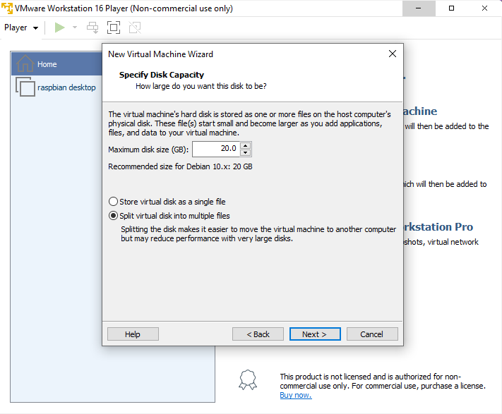

# Module 1. Exploring Raspberry Pi OS.
This is how I install and run Raspberry Pi os on Virtual machine (VM). Unfortunately I don't have the opportunuty to use the real hardware or the real Raspberry Pi board, So in this blog will only contain how I install and set up the Raspberry Pi os on VM.  
  

## What is Raspberry pi OS?
Raspberry pi OS or Raspbian is a Debian-based operating system for Raspberry Pi board. And because it is optimized for a one board computer so it's really light-weight linux distro and it's really great for an old computer. You can install Debian with Raspberry Pi Desktop as your computer’s main operating system, run it in a virtual machine, or create a USB stick or other medium from which you can run it when required. But for this article I'll download and run it on VM.  

## 1. Download Your favorite VM
Firstly, choose your favourite virtual machine and download it. For me, I'll use VMware which can be download from VMware website or you can click [THIS LINK](https://www.vmware.com/products/workstation-player.html).  
  

## 2. Download Raspberry Pi OS Desktop ISO
You can download it from Raspberry Pi website or you can click [THIS LINK](https://www.raspberrypi.com/software/raspberry-pi-desktop/) and click on the download button.

This is the longest part, as the ISO file is more than 2GB.  

## 3. Create a new virtual machine for Raspberry Pi OS Desktop
Open VMware. Click Create a New Virtual Machine on the right menu bar. I get a pop-up window for me to choose a way to install a guest operating system, I choose "Installer disc image file (ISO)" and browse location of Raspberry Pi OS ISO. Click next.  
  

### Select a Guest Operating System
Next, choose the operating system. Since Raspberry Pi OS is a Debian based operating system, So I choose Linux for "Guest operating system" and "Version" select Debian 10.x since Raspbery Pi OS is debian version 11(bullseye). Click next.  

### Name the Virtual Machine
Now I have to set a name for my virtual machine which can be whatever. So, I'll go with "raspbian desktop" for the name and I have to choose location for my virtual machine. Click next.  
  

### Specify Disk Capacity
This is where you set up the disk size for the Virtual Machine. I set it to 20GB as the recommendation for debian 10.x based is 20GB. I choose split virtual disk in to multiple file because it is easier to move virtual machine to another computer as I may have to transfer it to the actual Raspberry Pi board.  
  
