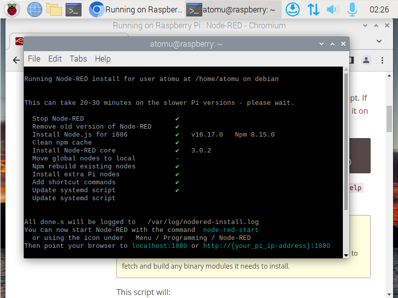

# 3  Exploring Node-RED
Node-RED is a flow-based development tool for visual programming developed originally by IBM for wiring together hardware devices, APIs and online services as part of the Internet of Things.

## 3.1  Install/run Node-RED using Linux VM(Raspbian OS) and RPI hardware.
I discovered that installing Node-RED on VM and RPI hardware are pretty similar so I will just do a tutorial on how I install Node-RED using Raspbian OS VM. And ่

### 1.) Installing and upgrading Node-RED
There is a script to install node.js, npm and Node-RED onto a Raspberry Pi. I found this on [nodered.org](https://nodered.org/docs/getting-started/raspberrypi)  
Running the following command will download and run the script. If you want to review the contents of the script first, you can view it on Github.  
```bash
bash <(curl -sL https://raw.githubusercontent.com/node-red/linux-installers/master/deb/update-nodejs-and-nodered)
```  
After running the script if you get download status like this, then you are good to go!  
  
  

### 2.) Run Node-RED
After finished download, it's time to run it. To run it all you have to do is running this command.  
```bash
node-red
```  
You will get this on your terminal. Scroll down, and you will see  a link to your flow.  
  
  
  
And here is your flow.  
  
  
