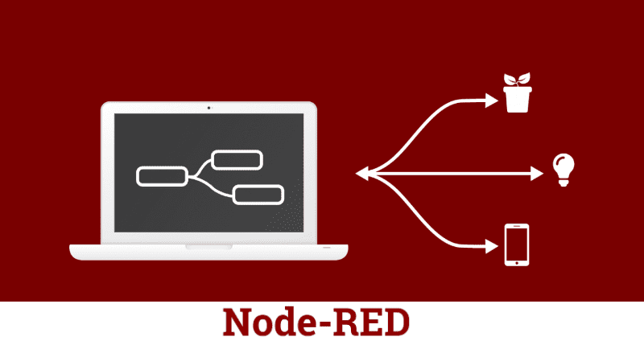
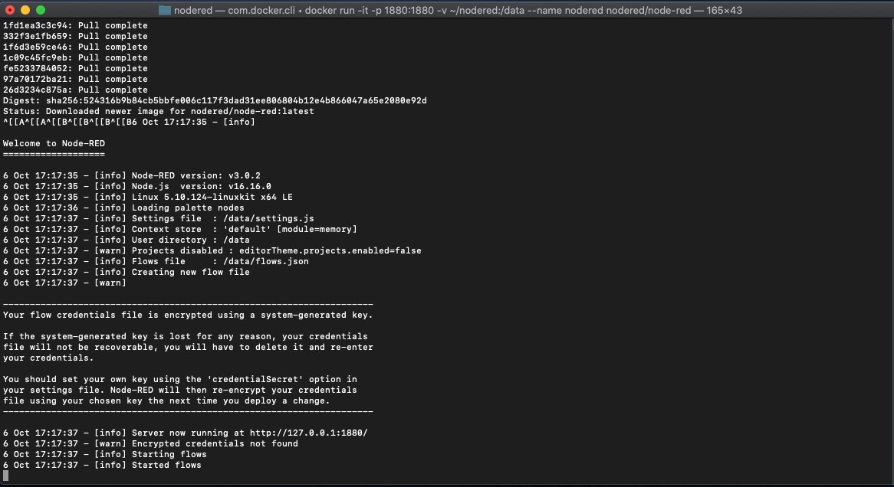
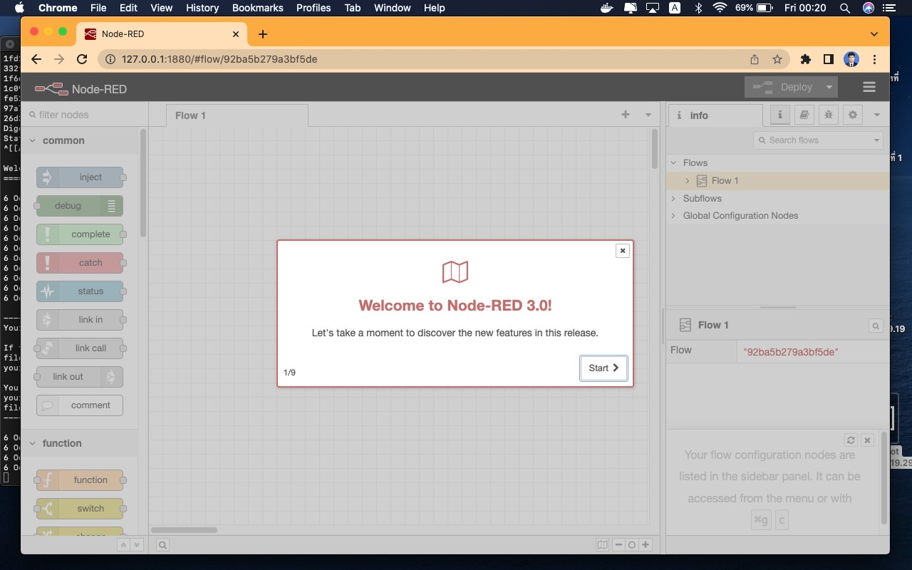

# 3  Exploring Node-RED
Node-RED is a powerful open-source tool for building Internet of Things (IoT) applications with the goal of simplifying the programming component.  
  
Node-RED runs on the web browser and it uses visual programming that allows you to connect code blocks, known as nodes, together to perform a task. The nodes when wired together are called flows.  
  
  

## 3.1  Install/run Node-RED using Docker container (using either Linux VM or RPi).
I discovered that installing Node-RED on VM and RPI hardware are pretty similar so I will just do a tutorial on how I install Node-RED using Raspbian OS VM. And ่

### 1.) Installing Node-RED
There is a script to install Node-RED onto a Docker. I found this on [nodered.org](https://nodered.org/docs/getting-started/docker)  
Running the following command will download and run the script. If you want to review the contents of the script first, you can view it on Github.  
```
docker run -it -p 1880:1880 -v YOUR_LOCAL_FOLDER_HERE:/data --name nodered nodered/node-red
```  

`YOUR_LOCAL_FOLDER_HERE` Path you want to install Node-Red
Ex. /Users/doubleu02/nodered

After running the script if you get download status like this, then you are good to go!  
  
  

### 2.) Run Node-RED
After finished download, it's time to run it. To run it all you have to do is running this command.  
Copy `https//127.0.0.1:1880` paste on Browser 
You will get this on your terminal. Scroll down, and you will see  a link to your flow.  

  
